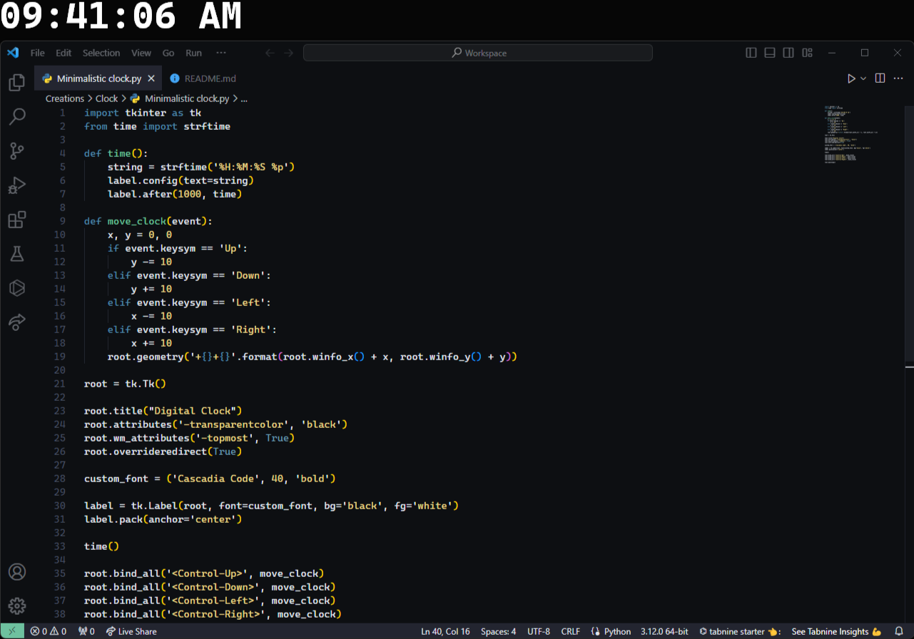

# About this Minimalistic Clock

This program is a simple minimalistic clock created using the Tkinter library, written entirely in Python. I hope you appreciate this straightforward project of mine. **Enjoy!**

## Features
- Utilizes the beautiful ['Cascadia Code'](https://github.com/microsoft/cascadia-code/releases) font.
- Displays the current time in the *HH:MM:SS* format, including an *AM/PM* indicator.
- Enables position change using *Ctrl + arrow keys*.
- There is no *menutitle* in this project.
- Always on top!

## Usage
1. Install the 'Cascadia Code' font from [GitHub](https://github.com/microsoft/cascadia-code/releases).
2. Run the `digital_clock.py` file.
3. Use Ctrl + Arrow keys to move the clock to different positions on the screen.

Feel free to customize the clock's appearance or functionality according to your preferences.

## Images

